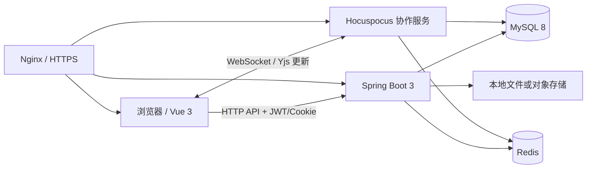

# 云笺 DocFlow

云笺 DocFlow 是一个面向团队知识协作的在线文档平台。项目采用 Spring Boot 3、Vue 3、Tiptap、Yjs 与 Hocuspocus，实现富文本分页编辑、多人实时协作、离线恢复、权限分享、版本历史、批注审阅、文档导入导出和管理后台。


## 核心能力

- **文档与空间管理**：文档和文件夹 CRUD、搜索、收藏、置顶、移动、复制、模板、回收站保留期限与批量操作。
- **富文本编辑**：标题、列表、引用、代码、链接、图片、表格、任务列表、公式、脚注、文献引用、目录、查找替换和纸张分页显示。
- **实时协作**：Yjs CRDT + Hocuspocus，多用户光标与选区、离线草稿、断线重连、重复更新去重和多节点广播。
- **版本与审阅**：命名版本、版本对比、回滚、批注线程、@提醒、修改痕迹和 CRDT checkpoint 历史。
- **导入与导出**：Markdown、TXT、DOC、DOCX 导入，以及 HTML、Markdown、TXT、DOCX、PDF 导出；正文 HTML 在前后端均执行安全净化。
- **认证与权限**：JWT Access Token、Refresh Token 轮换、设备会话、登录失败保护、验证码、文档四级权限和带密码分享。
- **附件与媒体**：普通附件、图片上传、分片上传、下载与删除；生产环境可接入恶意文件扫描。
- **运营管理**：用户管理、封禁、问题反馈、反馈图片、模板、日志、系统状态和面向全部/指定/按注册时间筛选用户的站内通知。
- **生产保障**：Flyway 迁移、Prometheus 指标、告警示例、Nginx/HTTPS、安全响应头、备份校验、发布与回滚脚本。

## 系统架构



Java 服务负责身份认证、业务接口、文档权限和文件访问；协作服务把 Yjs 更新作为二进制增量持久化，并定期生成 checkpoint。MySQL 是最终数据源，Redis 用于限流、状态和多节点协作广播，浏览器 IndexedDB 用于离线恢复。

## 技术栈

| 层级 | 主要技术 |
| --- | --- |
| 后端 | Java 17、Spring Boot 3.2.5、Spring Security、MyBatis-Plus、Flyway、Apache POI |
| 前端 | Vue 3、Vite 8、Pinia、Tiptap 3、DOMPurify、KaTeX、MathLive |
| 实时协作 | Yjs、Hocuspocus、y-indexeddb、Redis Pub/Sub |
| 数据与存储 | MySQL 8、Redis 6+、本地文件存储（可替换为私有对象存储） |
| 运维与安全 | Nginx、HTTPS、Prometheus、Alertmanager、CodeQL、Gitleaks、OWASP Dependency-Check |

## 仓库结构

```text
Javaproject/
├── docflow/           Spring Boot 多模块后端
├── docflow-collab/    Yjs/Hocuspocus CRDT 协作服务
├── docflow-web/       Vue 3 前端与富文本编辑器
├── documents/         需求、设计、API、测试、安全、部署和运维文档
├── deploy/            Nginx、systemd、监控、备份、发布与回滚示例
├── .github/           CI、安全扫描和依赖更新配置
├── CONTRIBUTING.md    贡献与开发约定
├── SECURITY.md        安全策略与漏洞报告说明
└── LICENSE            MIT 许可证
```

## 环境要求

- JDK 17
- Maven 3.9+
- Node.js 20.19+ 与 npm
- MySQL 8.0+
- Redis 6.0+

## 本地运行

启动顺序为 **MySQL → Redis → Java 服务 → CRDT 服务 → 前端**。

### 1. 初始化数据库

先创建空数据库：

```sql
CREATE DATABASE docflow CHARACTER SET utf8mb4 COLLATE utf8mb4_unicode_ci;
```

全新数据库推荐启用 Flyway，让后端执行 `V1__baseline.sql`：

```powershell
$env:DB_URL="jdbc:mysql://127.0.0.1:3306/docflow?useUnicode=true&characterEncoding=utf-8&useSSL=false&serverTimezone=Asia/Shanghai"
$env:DB_USERNAME="docflow"
$env:DB_PASSWORD="请替换为本地数据库密码"
$env:FLYWAY_ENABLED="true"
$env:FLYWAY_BASELINE_ON_MIGRATE="false"
```

已有数据库不要重复执行基线 SQL，请按 [部署与运维手册](documents/07-部署与运维手册.md) 的迁移流程处理。

### 2. 启动 Java 服务

至少为本地环境设置数据库密码、JWT 密钥以及与协作服务一致的管理密钥：

```powershell
$env:JWT_SECRET="请替换为至少32字节的随机字符串"
$env:CRDT_ADMIN_SECRET="请替换为协作服务共用的随机字符串"
cd D:\Javaproject\docflow
mvn -pl docflow-server -am spring-boot:run
```

接口默认地址：`http://localhost:8080`；管理指标默认只监听 `127.0.0.1:9091`。

### 3. 启动 CRDT 协作服务

```powershell
cd D:\Javaproject\docflow-collab
Copy-Item .env.example .env
# 编辑 .env，填写数据库密码，并让 CRDT_ADMIN_SECRET 与 Java 服务保持一致
npm install
npm start
```

WebSocket 默认地址：`ws://localhost:1234`。本地没有 Redis 时可在 `.env` 中设置 `CRDT_REDIS_ENABLED=false`；生产多节点必须启用 Redis。

### 4. 启动前端

```powershell
cd D:\Javaproject\docflow-web
Copy-Item .env.example .env
npm install
npm run dev
```

浏览器访问 `http://localhost:5173`。Vite 会将 `/api`、`/files` 和旧版 `/ws` 请求代理到 Java 服务。

> `.env`、本地数据库密码、JWT 密钥、邮箱授权码和证书都已被 `.gitignore` 排除，禁止提交真实生产凭据。

## 测试与构建

```powershell
# Java 单元测试
cd D:\Javaproject\docflow
mvn test

# CRDT 协作测试
cd D:\Javaproject\docflow-collab
npm ci
npm test

# 前端测试与生产构建
cd D:\Javaproject\docflow-web
npm ci
npm test
npm run build
```

协作测试覆盖并发编辑、重复与乱序更新、重连、checkpoint 恢复和权限判断；更多测试范围见 [测试计划与质量说明](documents/09-测试计划与质量说明.md)。

## 配置说明

无敏感信息的配置模板位于：

- Java：[`docflow/.env.example`](docflow/.env.example) 与 [`application-example.yml`](docflow/docflow-server/src/main/resources/application-example.yml)
- CRDT：[`docflow-collab/.env.example`](docflow-collab/.env.example)
- 前端：[`docflow-web/.env.example`](docflow-web/.env.example)
- 生产部署：[`deploy/`](deploy/)

生产环境必须替换 `JWT_SECRET`、`FILE_SIGNING_SECRET`、`CRDT_ADMIN_SECRET`、数据库/Redis/SMTP 密码，并启用 HTTPS、Secure Cookie、失败关闭的安全状态和私有文件访问。完整清单见 [生产上线安全加固指南](documents/17-生产上线安全加固指南.md)。

## 部署

仓库提供 Nginx、systemd、Prometheus/Alertmanager、自动备份、证书申请、健康检查、发布和回滚示例。生产部署前请依次阅读：

1. [部署与运维手册](documents/07-部署与运维手册.md)
2. [生产上线安全加固指南](documents/17-生产上线安全加固指南.md)
3. [生产部署备份监控与回滚指南](documents/18-生产部署备份监控与回滚指南.md)
4. [项目验收与交付清单](documents/14-项目验收与交付清单.md)

本地文件存储适合开发和单机部署。多节点或正式生产环境建议切换到私有对象存储，并通过短期签名 URL 提供访问。

## 工程文档

[`documents/00-项目文档总览.md`](documents/00-项目文档总览.md) 提供完整阅读顺序。文档覆盖需求规格、概要/详细设计、数据库字典、API、接口测试、用户手册、CRDT 恢复、安全、故障预案、发布流程和验收清单。

## 已知边界

- 编辑器分页基于单个 ProseMirror/Yjs 文档的页面投影，不等同于完整的 Word 排版引擎。
- DOC、DOCX、PDF 与 Markdown 转换覆盖常用结构，不承诺复杂 Word 特性、自定义插件或任意 HTML 完全无损。
- 自定义 MathML、复杂浮动布局、特殊字体和第三方 Markdown 扩展会采用可预测的降级策略。

## 参与贡献

提交问题或代码前请阅读 [CONTRIBUTING.md](CONTRIBUTING.md)。安全漏洞不要提交公开 Issue，请按 [SECURITY.md](SECURITY.md) 中的方式报告。

## 许可证

本项目采用 [MIT License](LICENSE)。
