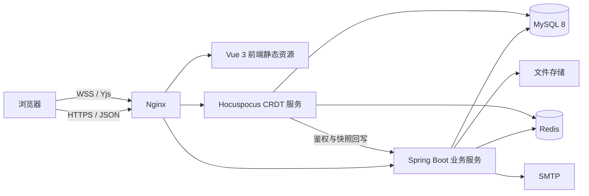

# 云笺 DocFlow 在线协作文档平台概要设计

## 1. 引言

### 1.1 编写目的

本文描述云笺 DocFlow 的系统边界、总体架构、技术选型、功能模块、数据分层和非功能要求，作为详细设计、开发、测试与部署的共同基线。

### 1.2 项目目标

系统面向个人和小型团队，提供从文档创建、组织、协作编辑、审阅、版本恢复到导入导出的完整链路。核心目标是：

- 多用户在同一富文本文档中实时编辑并最终收敛。
- 所有 HTTP 与 WebSocket 入口执行统一身份和文档权限校验。
- 网络中断、重复消息、乱序消息和服务重启后正文可恢复。
- 文档管理、版本、批注、分享、附件、反馈和管理能力形成可用闭环。

### 1.3 非目标

- 不自行实现 OT 或简化版 CRDT 算法。
- 不承诺与 Microsoft Word 的全部排版、宏、SmartArt 和插件能力一致。
- 不把 Redis 当作最终持久化数据库。
- 不允许系统管理员角色自动绕过文档资源权限读取所有正文。

## 2. 系统角色

| 角色 | 能力 |
| --- | --- |
| 游客 | 注册、登录、通过有效分享链接查看文档 |
| 普通用户 | 管理自己的文档、文件夹、模板、附件、设备和反馈 |
| 文档协作者 | 按 `READ/COMMENT/WRITE/ADMIN` 权限查看、批注、编辑或管理指定文档 |
| 文档所有者 | 天然拥有指定文档的完整管理权限，无需额外权限记录 |
| 系统管理员 | 管理用户、反馈、系统模板、审计日志和运行状态，不等同于文档管理员 |

## 3. 总体架构

### 3.1 前端层

Vue 3 单页应用负责登录、工作区、富文本编辑、单页/双页显示、管理后台、系统提示和分享访问。Tiptap 提供编辑器文档模型，Yjs Provider 提供 CRDT 同步，y-indexeddb 保存离线状态。

### 3.2 Java 业务层

Spring Boot 服务负责账号、会话、文档元数据、文件夹、权限、分享、版本、批注、通知、文件、导入导出、反馈和管理后台。Spring Security 处理认证入口，Service 层执行资源权限和事务规则。

### 3.3 CRDT 协作层

Hocuspocus 使用标准 Yjs 二进制协议。Java 将文档 ID、JWT 和权限结果提供给协作服务；协作服务把更新作为不透明二进制保存到 MySQL，并通过 Redis 扩散到其他节点。

### 3.4 数据与基础设施层

- MySQL：账号、权限、元数据、版本、CRDT 增量和 checkpoint 的权威存储。
- Redis：验证码/旧协作暂存和 CRDT 多节点实时广播，不承担最终持久化。
- 文件存储：头像、DOCX 图片、附件和反馈截图；当前为本地目录。
- SMTP：邮箱变更和密码找回验证码。

## 4. 技术选型

| 层次 | 技术 | 选择理由 |
| --- | --- | --- |
| 后端 | Java 17、Spring Boot 3.2.5 | 成熟的 Web、安全、事务和配置生态 |
| ORM | MyBatis-Plus 3.5.6 | 简化常规 CRUD，保留复杂 SQL 控制能力 |
| 安全 | Spring Security、JWT、BCrypt | 统一认证过滤、密码散列和资源鉴权 |
| 前端 | Vue 3、Vite、Pinia、Axios | 组件化、开发效率和状态管理 |
| 编辑器 | Tiptap 3、ProseMirror | 可扩展富文本模型，适配 Yjs |
| 协作 | Yjs、Hocuspocus、y-indexeddb | 成熟 CRDT、Awareness、离线和编辑器适配 |
| 数据库 | MySQL 8 | 事务、关系约束、索引和 BLOB 持久化 |
| 广播 | Redis | 多节点 Pub/Sub 与协作状态扩散 |
| 文档处理 | Apache POI、Jsoup、OpenHTMLtoPDF | DOC/DOCX 解析、HTML 净化和 PDF 输出 |
| 公式 | MathLive、KaTeX | 结构化输入和公式渲染 |

## 5. 功能模块

### 5.1 账号与会话

- 注册、登录、密码修改和找回。
- 邮箱验证码、个人资料和头像。
- Access Token、Refresh Token 轮换、闲置超时和绝对有效期。
- 登录设备查看、单设备撤销和其他设备全部退出。
- 账号封禁、可选自动解封和封禁原因提示。

### 5.2 文档工作区

- 文档与树形文件夹 CRUD、复制、移动、置顶、收藏和标签。
- 最近编辑、回收站、批量移动/删除/恢复/彻底删除。
- 回收站保留期限和定时清理。
- `Ctrl + K` 权限内全局搜索文档、文件夹和可协作用户。
- 空白、模板和文件导入创建，可选择封面。

### 5.3 编辑与排版

- Markdown 和富文本模式，常用标题、列表、链接、图片、代码和表格。
- A4/Letter、页边距、页眉页脚、页码、单页/双页和缩放。
- 表格行列操作、合并拆分、调整宽高、复制粘贴和跨页显示。
- 公式、公式编号与交叉引用、脚注、文献引用和目录。
- 搜索替换、字数统计、离线草稿和未同步状态。

### 5.4 实时协作

- CRDT 正文同步、在线用户、实时光标和选区。
- IndexedDB 离线编辑、断线重连和待同步数量。
- MySQL 增量更新、幂等去重、多代 checkpoint 和恢复。
- Redis 多节点广播；Redis 不可用时保持单节点持久化能力并明确降级。

### 5.5 权限、分享与审阅

- `READ/COMMENT/WRITE/ADMIN` 四级文档权限。
- 链接分享、可选密码和失效时间。
- 批注线程、回复、@提及、未读通知、筛选和解决。
- 手动版本、版本命名/说明、左右差异对比、回滚和 CRDT checkpoint 恢复。

### 5.6 文件与格式交换

- 普通附件、图片、下载删除和大文件分片上传。
- Markdown、TXT、DOC、DOCX 导入；富文本经过服务端安全净化。
- DOCX、PDF、离线 HTML、Markdown 和 TXT 导出。

### 5.7 反馈与系统管理

- 用户提交问题类型、描述、关联文档和最多 6 张截图。
- 用户查看自己的处理状态和管理员回复。
- 管理后台包含总览、用户、反馈、系统提示、系统模板、审计日志和系统状态。
- 管理员可调整系统角色、封禁/解封用户和强制撤销设备。
- 管理员可向全部用户、指定用户名或注册时间范围内用户发送提示；接收者在工作区顶部查看并可关闭。

## 6. 数据架构概要

正式 `schema.sql` 包含 23 张表，分为：

- 账号安全：`user`、`user_session`、`verification_code`。
- 文档资产：`folder`、`document`、`document_favorite`、`tag`、`document_tag`、`document_template`。
- 协作权限：`doc_permission`、`document_comment`、`comment_mention`、`user_notification`。
- 版本与 CRDT：`doc_version`、`crdt_update`、`crdt_checkpoint`、`crdt_checkpoint_history`。
- 文件与引用：`file_attachment`、`attachment_upload_session`、`document_reference`。
- 运营管理：`operation_log`、`user_feedback`、`feedback_image`。

`document.content` 是便于搜索、导出和非协作读取的物化 HTML；CRDT 真状态由 checkpoint 和其后的增量共同构成。

## 7. 核心业务原则

1. 文档所有者以 `document.owner_id` 为唯一事实来源，天然拥有完整权限。
2. 新文档默认 `collab_mode=CRDT`，正文只通过 Yjs 通道修改。
3. 系统管理员与文档 `ADMIN` 权限严格分离。
4. Refresh Token 数据库只保存 SHA-256 摘要，并在刷新后立即轮换。
5. checkpoint 写成功后才能删除已覆盖增量。
6. 上传、导入和富文本保存都经过类型、大小、路径和 HTML 安全校验。
7. 面向用户的错误信息使用清晰中文，不暴露堆栈、SQL 和密钥。

## 8. 非功能要求

### 8.1 性能

- 常规列表和详情接口在开发规模数据下应保持可交互响应。
- 搜索结果、后台列表和通知列表必须限制返回数量或分页。
- 大附件使用分片上传；大文档避免每次按键全量写 MySQL。
- checkpoint 降低重启时重放增量的数量。

### 8.2 安全

- 生产环境必须使用 HTTPS/WSS、强随机 JWT 密钥和 CRDT 管理密钥。
- 密码、验证码、Refresh Token 和分享密码不得明文记录日志。
- 后端必须执行资源级权限校验，不能依赖前端隐藏按钮。
- 管理端口只监听内网或本机，不通过公网反向代理。

### 8.3 可用性与恢复

- 浏览器离线更新保存在 IndexedDB，恢复网络后由 Yjs 合并。
- MySQL checkpoint 和增量支持协作服务重启恢复。
- Redis 故障不应造成已持久化正文丢失，但会影响跨节点实时广播。
- 数据库、上传目录和生产配置必须纳入备份。

### 8.4 可维护性

- Controller、Service、Mapper、编辑器扩展和协作存储职责分离。
- 数据库变更使用版本化升级脚本，后续建议接入 Flyway/Liquibase。
- 关键流程应有自动化测试和部署冒烟测试。

## 9. 部署拓扑建议

开发环境可运行单个 Java、前端和 CRDT 节点。生产环境建议：

- Nginx 终止 TLS 并分别反代 `/api` 和 CRDT WebSocket。
- Java 服务和 CRDT 服务以独立进程或容器运行。
- MySQL 启用定期备份，Redis 启用持久化和监控。
- 文件迁移到对象存储，使用私有桶和短期签名 URL。
- 多个 CRDT 节点必须启用 Redis，并设置唯一 `CRDT_SERVER_NAME`。

## 10. 风险与演进

| 风险 | 当前措施 | 后续方向 |
| --- | --- | --- |
| 大文档分页性能 | 单一文档、测量缓存、受控缩放 | 章节分区和虚拟化 |
| 本地文件多节点不一致 | 单机受控目录 | 对象存储和 CDN |
| 手工 SQL 重复执行 | 可重复升级脚本 | Flyway/Liquibase |
| 复杂 Word 格式损失 | 常用结构映射和降级 | 更完整 OOXML/字体测试 |
| Web Storage 的令牌风险 | HTML 净化、短期令牌、可撤销会话 | HttpOnly Cookie、CSP |
| 缺少真实容量数据 | 功能测试 | 压测、指标和容量规划 |
