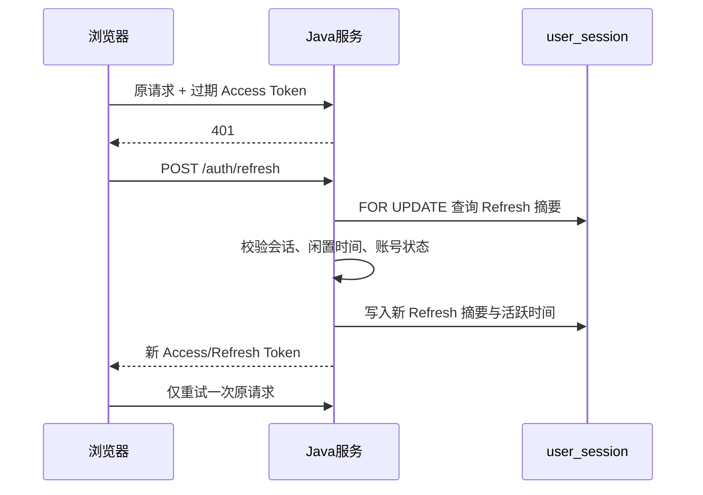

# 云笺 DocFlow 在线协作文档平台详细设计

## 1. 设计范围

本文描述当前 `docflow`、`docflow-web` 和 `docflow-collab` 的模块职责、核心流程、状态模型、事务边界和异常策略。数据库字段详见 `04-数据库设计与数据字典.md`，接口目录详见 `05-API接口设计说明.md`。

## 2. 工程结构

```text
D:/Javaproject/
├─ docflow/
│  ├─ docflow-common/          公共模块
│  └─ docflow-server/
│     └─ src/main/java/com/docflow/
│        ├─ config/            Security、MVC、WebSocket、密码编码器配置
│        ├─ controller/        HTTP 入口
│        ├─ service/           业务规则和事务
│        ├─ mapper/            MyBatis-Plus Mapper
│        ├─ entity/            数据库实体
│        ├─ dto/               请求对象
│        ├─ vo/                响应视图
│        ├─ security/          JWT、用户上下文、后台拦截器
│        └─ scheduler/         回收站和旧协作持久化任务
├─ docflow-web/
│  └─ src/
│     ├─ api/                  Axios 与 Refresh Token 串行刷新
│     ├─ components/           编辑器、弹窗、侧栏等组件
│     ├─ store/                用户、文档和 UI 状态
│     ├─ router/               登录、分享、工作区和后台路由
│     ├─ utils/                转换、提示、认证和对话框
│     └─ views/                登录、列表、编辑、分享、后台
└─ docflow-collab/
   ├─ src/server.js            Hocuspocus 服务入口
   ├─ src/authorization.js     Java 鉴权适配
   ├─ src/store.js             增量/checkpoint 持久化
   ├─ src/admin-server.js      内部 checkpoint 管理接口
   └─ src/schema.js            与前端一致的 Tiptap/Yjs schema
```

## 3. 统一接口与异常模型

### 3.1 HTTP 约定

- 业务 API 前缀：`/api/v1`。
- JSON 请求使用 `Content-Type: application/json`。
- 文件上传使用 `multipart/form-data`。
- 受保护接口使用 `Authorization: Bearer <accessToken>`。
- 成功和业务失败使用统一 `Result<T>`，成功码为 `200`。
- 文件下载和导出直接返回二进制响应，不再包裹 `Result`。

### 3.2 异常分层

| 类型 | 示例 | 处理 |
| --- | --- | --- |
| 参数错误 | 空标题、非法权限、文件过大 | 返回明确中文 400 类业务错误 |
| 未认证 | Token 缺失、过期、会话撤销 | 返回 401，前端尝试一次 Refresh |
| 无权限 | 非所有者删除、普通用户访问后台 | 返回 403，不暴露资源细节 |
| 未找到 | 文档、版本或反馈不存在 | 返回 404 业务错误 |
| 冲突 | LEGACY 修订号不一致、恢复失败 | 返回 409 并提示刷新 |
| 系统故障 | 数据库、SMTP、CRDT 管理服务异常 | 安全日志记录摘要，响应不返回堆栈 |

## 4. 认证与会话设计

### 4.1 注册和登录

1. 注册校验用户名、邮箱和密码，密码使用 BCrypt 散列。
2. 登录查询用户并检查 `status`；封禁账号返回封禁原因。
3. 登录成功创建 `user_session`，记录 token ID、设备、IP、活跃时间和绝对过期时间。
4. 签发短期 Access Token 和 48 字节安全随机 Refresh Token。
5. Access Token 包含用户 ID、用户名和 token ID；Refresh Token 数据库只保存 SHA-256 摘要。

### 4.2 Token 刷新



前端使用单个 `refreshPromise` 合并并发 401，防止多个请求同时轮换同一 Refresh Token。刷新失败时清理存储并跳转登录页。

### 4.3 会话失效

- 默认闲置超时 30 分钟。
- 普通会话绝对有效期 7 天，保持登录默认 30 天。
- 主动退出、密码重置、设备撤销或管理员封禁会写 `revoked_at` 并清空 Refresh 摘要。
- JWT Filter 每次鉴权检查 token ID 对应会话和账号状态，不能只验证 JWT 签名。
- 可选封禁到期后，在下一次账号安全校验时自动解封。

## 5. 文档与文件夹设计

### 5.1 创建文档

1. 当前用户 ID 从安全上下文取得。
2. 在事务中写入 `document.owner_id`、`content_format` 和 `collab_mode=CRDT`。
3. 创建者权限由 `owner_id` 隐式提供，不插入重复 `doc_permission`。
4. JSON 创建支持空白、模板以及前端读取后的 Markdown/TXT 内容；multipart 创建复用同一 `/docs` 资源入口处理 DOC/DOCX 导入。
5. 事务提交并返回文档 ID 后，前端才进入编辑页并连接 Hocuspocus。

### 5.2 更新文档

- CRDT 文档的正文不能通过普通 PUT 全量覆盖，只允许协作服务回写物化快照。
- 普通 PUT 可修改标题、文件夹、分类、封面、纸张设置、收藏和置顶等元数据。
- LEGACY 文档保留修订号冲突检查，用于兼容历史内容，不继续扩展 OT。

### 5.3 删除与回收站

- 普通删除设置 `is_deleted=1` 和 `deleted_at`。
- 恢复清除删除标记；彻底删除清理关联数据和正文恢复状态。
- 默认保留 30 天，`TrashCleanScheduler` 按配置的 cron 清理超期文档。
- 列表默认排除回收站；批量操作逐项执行权限校验。

### 5.4 文件夹

- `parent_id=0` 表示用户根目录。
- 所有查询必须带 `owner_id`，禁止跨用户移动和修改。
- 删除文件夹前应处理子文件夹和文档；当前行为以 Service 实现为准，前端必须二次确认。

## 6. 文档权限设计

### 6.1 权限级别

| 权限 | 查看 | 批注 | 编辑正文 | 管理协作者/分享 |
| --- | --- | --- | --- | --- |
| READ | 是 | 否 | 否 | 否 |
| COMMENT | 是 | 是 | 否 | 否 |
| WRITE | 是 | 是 | 是 | 否 |
| ADMIN | 是 | 是 | 是 | 是 |
| 所有者 | 是 | 是 | 是 | 是 |

### 6.2 判定顺序

1. 读取文档并检查是否存在、是否允许当前操作的删除状态。
2. `document.owner_id == currentUserId` 时直接授予完整权限。
3. 否则查询 `doc_permission` 的用户协作者记录。
4. 分享链接记录使用 `share_token`，不作为登录用户协作者权限。
5. CRDT WebSocket 连接调用同一 Java 权限接口，不能维护另一套规则。

### 6.3 系统管理员隔离

`user.system_role=ADMIN` 只允许访问平台管理接口。系统管理员不因角色自动获得所有文档正文权限。前端路由守卫只负责体验，`AdminInterceptor` 和 `AdminAuthorizationService` 是后台接口安全边界。

## 7. CRDT 实时协作设计

### 7.1 连接

1. 浏览器以文档 ID 为 Hocuspocus document name，携带 Access Token。
2. 协作服务调用 Java `/docs/{id}/crdt/access`。
3. Java 校验会话、文档状态和 `read/write/admin` 范围。
4. 协作服务加载 checkpoint 与其后的更新，恢复 Y.Doc。
5. Yjs 交换状态向量，仅同步缺失结构。

### 7.2 增量持久化

- Payload 是未经自定义包装的 Yjs `Uint8Array`。
- `updateId = SHA-256(documentId + payload)`。
- `crdt_update` 使用 `(doc_id, update_id)` 唯一索引和 `INSERT IGNORE` 去重。
- 单条更新受 `CRDT_MAX_UPDATE_BYTES` 限制。
- Redis 扩展广播更新和 Awareness；MySQL 是最终恢复来源。

### 7.3 checkpoint

```text
锁定当前 checkpoint
  → 备份旧 checkpoint 到 history
  → 写入新完整 Y.Doc 和高水位
  → 删除已覆盖增量
  → 限制历史代数
  → 提交事务
```

任何一步失败都回滚，旧 checkpoint 和增量继续保留。恢复历史 checkpoint 前先保存当前状态为 `PRE_RESTORE`，然后替换当前 checkpoint、删除目标之后的增量并卸载内存文档，客户端重连后重新同步。

### 7.4 物化 HTML

checkpoint 成功后，协作服务把 Y.Doc 转为 HTML，并调用 Java 快照接口。Java 再次净化 HTML，更新 `document.content`、摘要、哈希、修订号、最后编辑者和 `updated_at`。因此列表搜索和导出不需要直接解析 CRDT 二进制。

### 7.5 离线与故障

- y-indexeddb 保存浏览器本地 Y.Doc 更新。
- 断线后显示离线状态和待同步数量，重连后由状态向量合并。
- Redis 暂时不可用时，同一节点仍可协作和写 MySQL；跨节点实时性降级。
- MySQL 不可用时不能宣称已保存，协作服务必须记录失败并重试或拒绝启动。

## 8. 编辑器与分页设计

### 8.1 文档模型

Tiptap/ProseMirror 是富文本规范模型，包含标题、段落、列表、任务列表、代码、链接、图片、表格、公式、脚注、文献引用、批注标记、修订标记和显式分页符。前端与协作服务必须注册兼容 schema，避免未知节点在转换时丢失。

### 8.2 分页原则

- 内部始终保持一个连续 ProseMirror/Yjs 文档，不把每页拆成独立编辑器。
- 页面视图依据纸张尺寸、页边距和块实际高度生成投影。
- 普通段落允许按行跨页；表格按行和单元格内容计算跨页位置。
- 单页默认 100%，双页默认 80%；`Ctrl + 鼠标滚轮`只改变显示缩放。
- 双页固定两列、按行向下排列，奇数尾页居中。
- 页边距遮罩禁止正文和表格线显示在页眉页脚区域。

### 8.3 限制

单个超高表格行、复杂跨行合并、超长不可分代码块和超大图片不能任意物理切分。实时分页强调可编辑和协作稳定，不等同于专业桌面排版引擎。

## 9. 导入、导出与内容安全

### 9.1 导入

- 允许 Markdown、TXT、DOC 和 DOCX：Markdown/TXT 由前端读取并转换后走 JSON 创建，DOC/DOCX 由后端 multipart 接口解析。
- DOCX 使用 Apache POI 映射标题、段落、字符样式、列表、链接、表格和位图。
- DOC 通过 POI scratchpad 做兼容解析，复杂旧格式可降级。
- DOCX 是 ZIP 容器，限制原文件大小、条目数、压缩率和解压总量。
- 内嵌图片保存到文件目录，正文只保存 URL，不写入大 Base64。
- 生成 HTML 后通过 Jsoup 白名单净化。

### 9.2 Markdown 与富文本

支持标题、粗斜体、删除线、列表、引用、代码、链接、图片、表格、分割线、任务列表、换行和空段落。下划线使用安全 HTML；批注、复杂合并表格、自定义 CSS 等无法无损表达的结构使用可预测降级。

### 9.3 导出

- DOCX：服务端生成，尽可能嵌入本地图片并保留常用表格、列表和分页。
- PDF：OpenHTMLtoPDF，生产环境需配置中文字体。
- 离线 HTML：内联样式和可访问的本地图片，不依赖系统登录态打开。
- Markdown/TXT：由前端转换并下载，复杂富文本结构可能降级。

## 10. 批注、通知和版本

### 10.1 批注

正文中的 comment mark 保存位置锚点，`document_comment` 保存线程内容。回复使用 `parent_id`，状态为 OPEN/RESOLVED；@提及写 `comment_mention` 并创建通知。删除批注时同时处理正文标记和数据库线程。

### 10.2 通知

通知支持批注回复、@提及、反馈处理和管理员系统提示。读取接口按当前用户过滤，可用 `type` 精确筛选，支持单条已读和全部已读。

管理员系统提示复用 `user_notification`，发送时按接收范围查询用户并在同一事务中逐用户写入 `ADMIN_MESSAGE`。范围包括全部用户、精确用户名和注册时间区间；时间区间允许只给开始或结束边界，但开始不得晚于结束。提示正文最长 500 字，审计日志只记录范围和接收人数，不复制提示正文。前端每 30 秒查询未读系统提示，在工作区顶部显示最新一条；关闭提示等同于把该用户自己的通知标记为已读。

### 10.3 用户版本

`doc_version` 保存用户可读的命名版本、说明、正文和来源修订。版本对比采用左右布局并突出插入、删除或变化区域。回滚前应保留当前内容，CRDT 文档的正文恢复需要与 checkpoint 流程协调。

## 11. 文件与附件

### 11.1 普通上传

服务端规范化文件名、生成存储名、限制大小并返回受控 URL。头像、反馈图片、导入图片和文档附件使用不同子目录。

### 11.2 分片上传

1. 创建 `attachment_upload_session`，提交文件名、总大小、分片数和 SHA-256。
2. 前端按约 5 MB 分片，最多 3 个并发上传。
3. 服务端限制单片大小，按索引保存临时文件并防止重复分片。
4. 完成时按顺序合并，校验大小和 SHA-256，再创建 `file_attachment`。
5. 每小时清理超时会话和临时文件。

## 12. 反馈与管理后台

### 12.1 反馈

- 类型：BUG、UI、SUGGESTION、OTHER。
- 状态：OPEN、PROCESSING、RESOLVED、CLOSED。
- 描述最长 5000 字，管理员回复最长 2000 字，最多 6 张图片。
- 关联文档前校验提交人至少有读取权限。
- 用户只能查看自己的反馈；管理员可筛选、处理并回复。

### 12.2 用户管理

- 查询用户名、昵称、邮箱、状态和角色，列表限制最多 200 条。
- 封禁可记录原因和可选解封时间，并立即撤销全部会话。
- 防止管理员封禁自己或取消自己的管理员角色。
- 高风险动作写 `operation_log`。

### 12.3 系统提示

- `POST /api/v1/admin/notifications` 只允许平台管理员调用。
- `ALL` 发送给全部未逻辑删除账号；`USER` 按完整用户名发送；`REGISTERED_AT` 按 `user.created_at` 查询。
- 一次发送为每位接收者生成独立通知，因此各用户的关闭/已读状态互不影响。
- 当前采用事务内扇出，适合本项目规模；若用户量显著增长，应演进为任务队列或 outbox 异步批处理。

### 12.3 系统状态

后台展示用户、文档、回收站、待处理反馈、活动设备、附件容量、上传会话和 CRDT 恢复数据的概览。当前为轻量运行视图，不代替 Prometheus、日志平台和数据库监控。

## 13. 缓存与定时任务

| 任务/缓存 | 用途 | 默认策略 |
| --- | --- | --- |
| Redis CRDT 广播 | 多节点同步更新和 Awareness | 生产多节点必须启用 |
| 旧协作草稿 | LEGACY 暂存 | TTL 168 小时 |
| 旧协作持久化 | 每 30 秒物化旧模式内容 | fixed delay 30000 ms |
| 回收站清理 | 彻底删除超期文档 | 每天 02:00，默认 30 天 |
| 分片会话清理 | 删除超时临时分片 | 每小时第 15 分钟 |
| CRDT checkpoint | 压缩增量、恢复基线 | 协作服务防抖 3 秒，最长 10 秒 |

## 14. 测试设计关注点

- 所有者无显式权限记录仍可读写管理。
- COMMENT 用户可批注但不能改正文；无权限用户 HTTP 和 WebSocket 均拒绝。
- 同时编辑、相同位置编辑、重复/乱序更新最终收敛。
- 断线重连、服务重启、checkpoint 失败和历史恢复不丢数据。
- Access Token 过期只触发一次刷新，Refresh Token 重放失败。
- 封禁后已有设备立即失效，普通用户不能访问后台。
- 正常、空、损坏、超大和恶意 DOCX 均有明确结果。
- 单页/双页、长段落、跨页表格、页边距和缩放不破坏正文。

## 15. 配置和敏感信息

生产环境必须外部配置数据库、Redis、SMTP、JWT、CRDT 管理密钥和文件目录。仓库中的示例值只能用于本地开发；日志禁止输出密码、验证码、Refresh Token、JWT 完整值和 CRDT 管理密钥。
