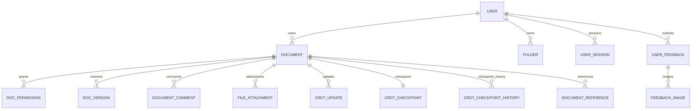

# 云笺 DocFlow 数据库设计与数据字典

## 1. 基本约定

- 数据库：MySQL 8.0，字符集 `utf8mb4`。
- 主键：业务表默认 `BIGINT AUTO_INCREMENT`。
- 时间：业务时间使用 `DATETIME`，CRDT 高精度时间使用 `DATETIME(3)`。
- 软删除：文档使用 `is_deleted + deleted_at`；其他表按业务直接删除或状态化。
- 正式建库脚本：`docflow/docflow-server/src/main/resources/db/schema.sql`。
- 已有数据库按日期顺序执行 `upgrade_*.sql`，不要重复手工拼接字段。

## 2. 关系概览

## 3. 正式表清单

| 表名 | 作用 | 关键字段/约束 |
| --- | --- | --- |
| `user` | 账号、资料、平台角色和封禁 | `username/email` 唯一；`system_role USER/ADMIN`；封禁原因与到期时间 |
| `folder` | 用户树形文件夹 | `owner_id,parent_id`；根目录使用 0 |
| `document` | 文档元数据和物化正文 | 所有者、文件夹、格式、协作模式、修订、封面和纸张设置 |
| `doc_permission` | 协作者或分享权限 | 用户协作者与 share token；READ/COMMENT/WRITE/ADMIN |
| `doc_version` | 用户可读版本 | `(doc_id,version_num)` 唯一；名称、说明、类型和正文 |
| `operation_log` | 业务与管理审计 | 操作者、动作、详情、IP、文档和时间 |
| `file_attachment` | 文档附件 | 文档、上传者、URL、文件名、MIME 和大小 |
| `tag` | 用户标签 | `(owner_id,name)` 唯一 |
| `document_tag` | 文档标签关系 | `(doc_id,tag_id)` 联合主键 |
| `document_favorite` | 用户收藏关系 | `(user_id,doc_id)` 联合主键 |
| `document_template` | 系统/个人模板 | `owner_id=NULL` 表示系统模板 |
| `verification_code` | 邮箱验证码 | 目标、用途、IP、哈希、过期和使用时间 |
| `user_session` | 登录设备与 Refresh 会话 | token ID 唯一；Refresh 摘要唯一；活跃、过期、撤销 |
| `user_feedback` | 用户问题反馈 | 类型、状态、描述、回复、处理人和关联文档 |
| `feedback_image` | 反馈截图 | 反馈、用户、URL、原名、大小和 MIME |
| `crdt_checkpoint` | 当前 Yjs 完整状态 | `doc_id` 主键；协议版本、高水位和 LONGBLOB |
| `document_comment` | 批注和回复线程 | `parent_id`、选中文本、状态、解决人 |
| `comment_mention` | 批注 @提及 | `(comment_id,user_id)` 唯一；`read_at` |
| `user_notification` | 站内通知 | 类型、消息、触发者、文档、批注和每个接收人的已读状态 |
| `crdt_update` | Yjs 增量日志 | `(doc_id,update_id)` 唯一；client ID、协议和 LONGBLOB |
| `crdt_checkpoint_history` | 多代恢复点 | 文档、高水位、原因、完整状态和创建时间 |
| `document_reference` | CSL/DOI 文献库 | 文档内 cite key/DOI 唯一；CSL JSON |
| `attachment_upload_session` | 分片上传会话 | 上传 ID、分片数、已收数、SHA-256、状态和过期 |

## 4. 核心字段说明

### 4.1 `user`

| 字段 | 说明 |
| --- | --- |
| `username` | 登录名和添加协作者时的稳定标识 |
| `nickname` | 可修改展示名称，不用于登录唯一性 |
| `password` | BCrypt 散列，不保存明文 |
| `status` | 1 正常，0 封禁 |
| `system_role` | 平台角色 USER/ADMIN，与文档 ADMIN 不同 |
| `ban_reason/banned_at/ban_expires_at` | 封禁原因、时间和可选自动解封时间 |
| `welcome_dismissed` | 是否隐藏只读欢迎文档 |

### 4.2 `document`

| 字段 | 说明 |
| --- | --- |
| `owner_id` | 文档所有者，天然拥有完整权限 |
| `folder_id` | 用户文件夹，0 表示根目录 |
| `content` | 搜索、导出和非协作读取使用的物化正文 |
| `content_format` | MARKDOWN 或 HTML |
| `collab_mode` | 新文档 CRDT；历史文档可 LEGACY |
| `revision/persisted_revision` | 修订及已持久化高水位，兼容旧路径和物化状态 |
| `content_hash` | 正文 SHA-256，用于变化识别 |
| `page_format/margin_*/page_header/page_footer` | 页面显示和导出的纸张、边距、页眉页脚设置 |
| `is_deleted/deleted_at` | 回收站软删除状态 |

### 4.3 `doc_permission`

- 用户协作者：`user_id` 非空，记录权限等级。
- 分享链接：`share_token` 非空，可保存密码、权限和失效时间。
- 文档所有者不需要再插入 ADMIN 记录。
- 生产环境分享密码应只保存安全散列；若当前库仍为明文字段，应作为安全改进项。

### 4.4 CRDT 表

- `crdt_update.id` 是文档内恢复高水位的全局自增序号。
- `update_id` 由文档 ID 与 payload 计算 SHA-256，唯一索引负责持久化幂等。
- `crdt_checkpoint.checkpoint_seq` 表示已覆盖的最高增量 ID。
- 恢复时加载 checkpoint，再查询 `id > checkpoint_seq` 的增量。
- 历史 checkpoint 的 `reason` 可为 AUTO、MANUAL 或 PRE_RESTORE。

### 4.5 `user_session`

- `token_id` 写入 Access Token，并在每次鉴权时关联会话。
- `refresh_token_hash` 只保存摘要；刷新后替换为新摘要。
- `last_active_at` 用于闲置超时，`expires_at` 用于绝对有效期。
- `revoked_at` 非空表示主动退出、密码重置、设备撤销或封禁。

### 4.6 `user_notification`

- `type` 当前包含 `MENTION`、`COMMENT_REPLY`、`FEEDBACK_UPDATED` 和 `ADMIN_MESSAGE`。
- 管理员群发采用发送时扇出：每位接收者一行，所以关闭提示只更新自己的 `is_read`。
- `actor_id` 保存发送管理员；系统提示不关联文档和批注，`doc_id/comment_id` 为空。
- 已有数据库执行 `upgrade_20260809_admin_message_notifications.sql`，全新数据库直接使用 `schema.sql`。

## 5. 索引原则

- 登录和唯一标识使用唯一索引：用户名、邮箱、token ID、Refresh 摘要。
- 文档列表按 `owner_id/is_deleted/updated_at` 组合查询。
- 协作者按 `doc_id/user_id` 查询，分享按 `share_token` 查询。
- CRDT 增量按 `doc_id,id` 顺序重放，按 `doc_id,update_id` 去重。
- 反馈按 `user_id,created_at` 和 `status,created_at` 查询。
- 索引名称在升级脚本中保持稳定，执行前先检查已存在字段和索引。

## 6. 数据一致性与事务

- 创建文档、初始元数据和必要快照属于一个事务边界。
- 封禁账号和撤销会话在同一业务事务中执行。
- checkpoint 事务必须先写新状态，再删除已覆盖增量。
- 分片合并只有在大小和 SHA-256 校验成功后才创建附件记录。
- 反馈主记录和截图元数据在事务中创建；文件落盘失败时清理已保存文件。

## 7. 历史遗留表

旧数据库可能存在 `doc_client_state`、`doc_crdt_update`、`doc_edit_lock`、`doc_operation`、`doc_snapshot` 和 `file_asset`。当前全新 `schema.sql` 不创建这些表，现行 Yjs 方案不使用 OT 表。删除前必须备份并确认代码、数据和部署实例均不再引用。

## 8. 迁移与备份

1. 全新环境只执行 `schema.sql`。
2. 已有环境按文件日期顺序执行缺失的 `upgrade_*.sql`。
3. 执行前备份数据库并确认字符集、版本和目标库。
4. 迁移后校验表数、字段、索引和关键数据量。
5. 长期应采用 Flyway/Liquibase，禁止通过修改已发布迁移脚本重写历史。

## 9. 备份建议

- 每日全量或物理备份，结合 binlog 做时间点恢复。
- 上传目录/对象存储与数据库同一恢复点备份。
- 定期演练恢复 `document`、权限、版本、`crdt_checkpoint` 和 `crdt_update`。
- 备份加密、访问最小化，并设置与业务要求一致的保留期限。
