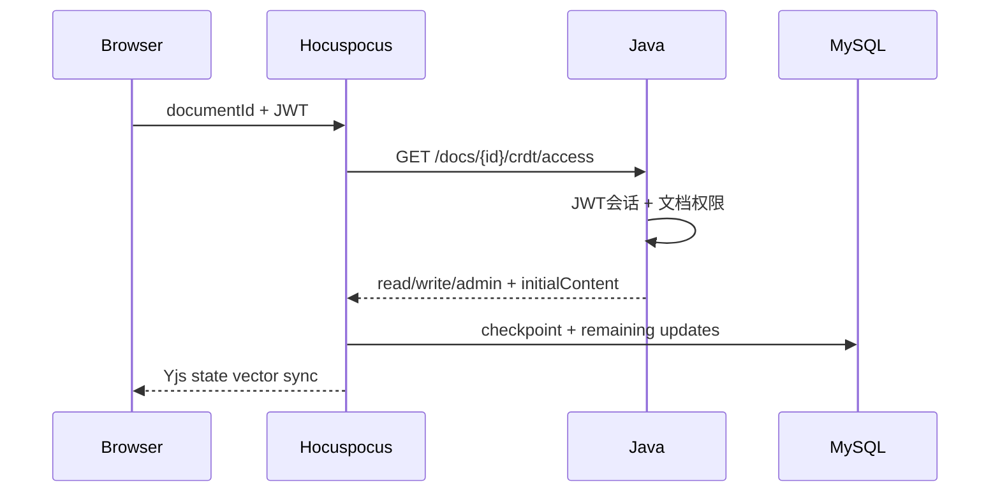

# 云笺 DocFlow CRDT 协作与数据恢复设计

## 1. 方案结论

项目最终采用 Yjs + Hocuspocus，不实现 OT，也不自行编写简化 CRDT。前端和协作服务共享兼容的 Tiptap schema；Java 把 Yjs 更新视为不透明二进制，只负责身份、权限、物化快照和管理入口。

## 2. 服务职责

| 组件 | 职责 |
| --- | --- |
| 浏览器 | Tiptap 编辑、Y.Doc、Awareness、IndexedDB 离线状态 |
| Java | JWT 会话、文档权限、初始 HTML、快照净化和 checkpoint 管理代理 |
| Hocuspocus | 标准 Yjs sync/awareness、连接生命周期和文档内存状态 |
| MySQL | `crdt_update`、当前 checkpoint 和历史 checkpoint |
| Redis | 多节点更新和 Awareness 广播 |

## 3. 协议映射

项目使用未修改的 Hocuspocus/Yjs 二进制协议：

| 字段 | 映射 |
| --- | --- |
| protocolVersion | 当前为 1，写入增量和 checkpoint |
| documentId | Hocuspocus document name 和 MySQL `doc_id` |
| clientId | 连接 ID；Yjs 内部还有自身 client clock ID |
| updateId | SHA-256(documentId + payload) |
| payload | 原始 Yjs Uint8Array update |

## 4. 连接流程



新文档必须在 Java 创建事务提交后才连接。文档所有者即使没有 `doc_permission` 记录也应返回完整权限。

## 5. 更新与去重

1. Tiptap 操作生成 ProseMirror 事务。
2. Yjs 生成二进制 update 并同步给 Hocuspocus。
3. 服务端限制 payload 大小。
4. 计算 updateId，使用唯一索引和 `INSERT IGNORE`。
5. 写 MySQL 后通过 Redis 广播到其他节点。
6. Yjs 的交换性和幂等性保证重复或乱序应用仍收敛。

数据库去重用于减少存储和处理，不替代 Yjs 自身收敛语义。

## 6. checkpoint 算法

### 6.1 创建

- 读取文档最大增量 ID 作为高水位。
- 编码完整 Y.Doc 状态。
- 事务锁定当前 checkpoint。
- 将旧 checkpoint 写入历史表。
- upsert 新 checkpoint。
- 删除 `id <= checkpoint_seq` 的已覆盖增量。
- 只保留配置数量的历史 checkpoint。

### 6.2 自动策略

默认写入防抖 3 秒，最长等待 10 秒。高频输入不会每个按键创建完整 checkpoint，服务关闭前刷新待保存状态。

### 6.3 恢复

1. 管理员选择历史 checkpoint。
2. 锁定目标文档当前状态。
3. 把当前 checkpoint 备份为 PRE_RESTORE。
4. 替换当前 checkpoint，删除目标高水位之后的增量。
5. 提交后断开活动连接并卸载内存文档。
6. 客户端重连，按状态向量获取恢复后的内容。

## 7. 服务重启恢复

加载顺序：

```text
current checkpoint
  + crdt_update where id > checkpoint_seq order by id
  = complete Y.Doc
```

没有 checkpoint 和增量时，使用 Java 返回的初始 HTML 创建 Y.Doc 并保存初始 checkpoint。

## 8. 物化快照

CRDT 二进制是实时正文权威状态，但业务列表、搜索、分享和导出需要 HTML。协作服务在 checkpoint 后转换 HTML，Java 使用 Jsoup 再净化并更新 `document.content`、摘要、哈希、修订号和时间。快照失败不得删除 CRDT 数据。

用户版本回滚不能只更新物化 HTML。Java 通过受共享密钥保护的协作管理接口提交目标 HTML；协作服务先在隔离 Y.Doc 中产生删除与插入更新并保存 checkpoint，成功后再应用到在线 Y.Doc，使当前客户端和持有旧状态的重连客户端都按 Yjs 状态向量收敛到回滚内容。

## 9. 多节点与 Redis

- 每个 CRDT 节点有唯一 `CRDT_SERVER_NAME`。
- Hocuspocus Redis 扩展广播文档更新和 Awareness。
- Redis 中断时节点内用户仍可同步并写 MySQL，但不同节点之间不能实时看到变化。
- Redis 恢复后客户端/Yjs 状态向量用于补齐缺失更新。
- MySQL 是最终持久化，禁止仅依赖 Pub/Sub 消息恢复。

两个已在生产环境确认过的配置陷阱：

- **Redis 认证参数的位置**：`@hocuspocus/extension-redis` 4.x 只读取配置里的 `options`，并原样作为第三个参数交给 ioredis（`new RedisClient(port, host, options)`）。顶层写 `password` 会被静默忽略，结果是带认证的 Redis 连不上，且日志里往往只看到连接失败而没有明显的配置错误。
- **监听地址**：`@hocuspocus/server` 的 `address` 默认是 `0.0.0.0`。生产必须显式设为 `127.0.0.1`（`CRDT_HOST`），对外只经 Nginx 反代，不要直接暴露 1234。

## 10. 前端离线

y-indexeddb 保存浏览器本地 Y.Doc。离线编辑继续生成更新并显示待同步数量；恢复连接后 Yjs 交换状态向量。退出登录或删除文档时要谨慎清理本地数据库，避免把无权限旧内容重新发送。

明确的清理时机（当前实现）：当客户端确认**失去写权限**（被降级为只读）或**失去访问权限**（被移除、文档进回收站）时，清理该文档的本地副本，并提示用户"此前未同步的本地修改已丢弃"。理由是：这些改动服务端已按只读拒绝写入，留在本地只会在日后恢复写权限时被合并回服务端，造成正文污染。服务端才是权威状态，清理后下次打开会重新从服务端拉取。

## 11. 权限

- READ/COMMENT 可连接为只读，不得提交正文更新。
- WRITE/ADMIN/所有者可以写正文。
- ADMIN/所有者可以查看和恢复 checkpoint。
- 文档删除、协作者权限降级或撤销后，Java 调用内部管理接口断开该文档活动连接；客户端重连时重新读取数据库权限。权限变化同时写入操作日志。
- 客户端侧的落实要求：**重连后必须重新拉取 `/docs/{id}/crdt/access` 并同步可编辑状态**——只在进入页面时读一次权限，会出现"服务端已改权限、界面仍可输入"的假象（此时写入会被服务端丢弃，只留在本地）。文档页的「重新同步」按钮用于手动对齐（重新确认权限、重连协作、刷新批注与协作者）。
- 回收站文档的详情、分享和协作鉴权均按不存在处理；彻底删除时同步清理三张现行 CRDT 持久化表。

## 12. 故障场景

| 故障 | 预期行为 |
| --- | --- |
| 重复 update | Yjs 幂等，数据库唯一键不重复保存 |
| 乱序 update | Yjs 最终收敛 |
| MySQL 写失败 | 不显示已持久化，重试或报错，不能丢弃本地更新 |
| Redis 失败 | 单节点可用，跨节点广播降级 |
| checkpoint 失败 | 事务回滚，旧 checkpoint 和增量保留 |
| checkpoint 的收尾步骤（历史裁剪）反复失败 | 手动建点、历史回滚、自动压缩会一起失效：该步骤是 `checkpoint()` 的最后一步，抛错即整笔回滚。已知原因是把 `LIMIT` 写成绑定参数（MySQL 预处理协议报 `ER_WRONG_ARGUMENTS`） |
| 远端更新到达时本地正在阅读别处 | 不应改变用户视口：远端更新事务会带 `scrollIntoView`，必须按"本地意图"门控，否则视口被拽回本地选区，表现为跳页与光标丢失 |
| Java 鉴权失败 | 拒绝连接，不伪装成数据库错误 |
| 协作服务重启 | checkpoint + 剩余增量恢复 |

## 13. 测试矩阵

- 两用户同时编辑不同位置和相同位置。
- 重复消息、随机乱序和延迟消息。
- 离线编辑后重连。
- checkpoint 前后重启。
- checkpoint 中间抛错并验证增量仍在。
- 两 CRDT 节点通过 Redis 同步。
- Redis 停止/恢复。
- 恢复历史 checkpoint 后客户端重连一致。
- READ/COMMENT/无权限/封禁用户的连接与写入边界。

## 14. 运维指标

- 当前连接数、每文档连接数。
- 增量写入错误与平均大小。
- 每文档待压缩增量数和字节数。
- checkpoint 时长、大小、失败次数和历史数量。
- Redis 重连次数和跨节点延迟。
- Java 鉴权 401/403/5xx 比例。

## 15. 已知限制

- 不支持把旧 LEGACY 历史内容自动无损转换为 CRDT 全历史。
- 超大单一 Y.Doc 的加载和内存仍会增长，后续需要章节分区或子文档。
- Awareness 是临时在线状态，不作为数据库审计历史。
- Redis Pub/Sub 不保存离线消息，恢复依赖 MySQL 与 Yjs 状态向量。
